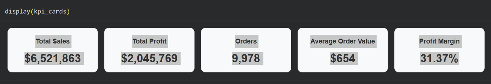
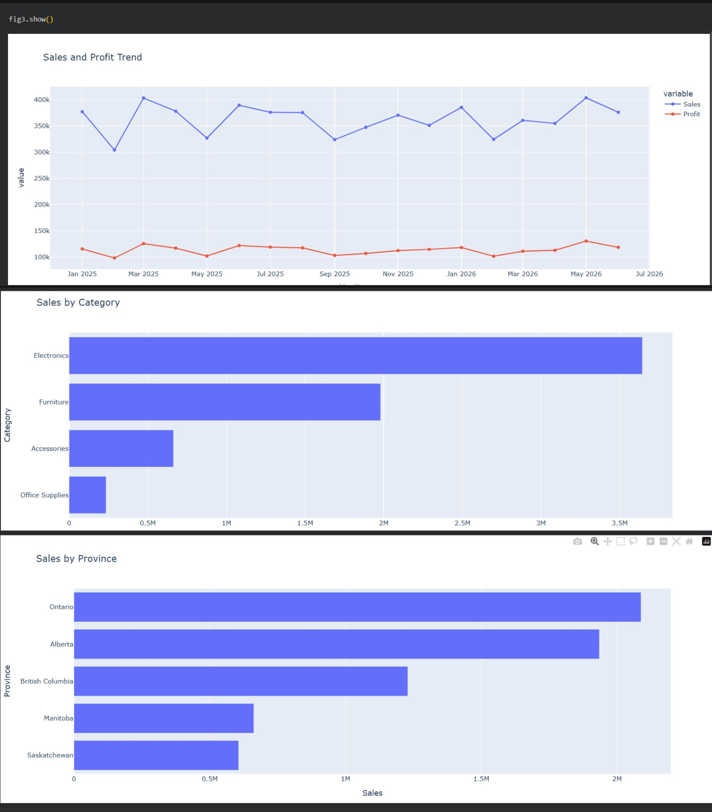
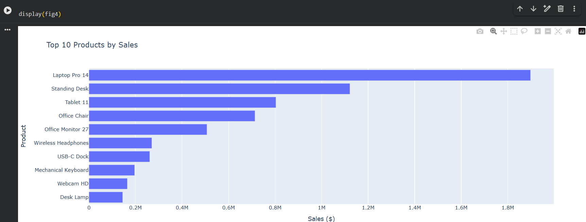

# Small Business Sales Analytics

## End-to-End Sales Analysis & Interactive Dashboard

This project demonstrates an end-to-end data analytics workflow for a fictional Canadian small-business retailer.

The project takes raw sales transaction data through data cleaning, validation, exploratory analysis, KPI development, and interactive dashboard creation using Python.

## Project Overview

The goal of this project is to analyze sales performance and provide management with a clear view of:

* Sales and profit trends
* Category performance
* Provincial performance
* Product performance
* Sales channel performance
* Key business KPIs

The dashboard allows users to filter results by **Province, Category, and Sales Channel**.

## Tools & Technologies

* Python
* pandas
* NumPy
* Plotly
* ipywidgets
* Google Colab
* GitHub
* CSV

## Data Preparation

The original dataset contained **10,075 rows**, including intentional data-quality issues.

The cleaning process included:

* Removing duplicate transactions
* Handling missing values
* Removing invalid dates
* Removing invalid quantities
* Removing invalid unit prices
* Standardizing text fields
* Creating calculated metrics
* Validating sales and profit calculations

After cleaning and validation, the final dataset contained **9,978 transactions** with no missing values or duplicate Order IDs.

## Key Business Results

| KPI                  |  Result |
| -------------------- | ------: |
| Total Sales          |  $6.52M |
| Total Profit         |  $2.05M |
| Total Orders         |   9,978 |
| Average Order Value  | $653.62 |
| Profit Margin        |  31.37% |
| Repeat Customer Rate |  85.71% |

## Key Insights

### Category Performance

**Electronics** generated the highest sales and profit among the four product categories.

### Product Performance

**Laptop Pro 14** was the strongest individual product by sales and profit.

### Provincial Performance

**Ontario** generated the highest total sales, followed closely by Alberta.

### Sales Channel Performance

**Online sales** were the largest contributor to both sales and profit.

### Customer Retention

The business had a strong **85.71% repeat-customer rate**, indicating a high level of customer retention.

### Discount Analysis

Discount levels did not show a simple linear relationship with profitability. Discount decisions should therefore be evaluated alongside sales volume, revenue, and profit margin.

## Dashboard

### Executive KPI Dashboard

### Sales Performance Charts

### Product Performance Dashboard

## Project Workflow

**Raw Data → Data Profiling → Data Cleaning → Data Validation → Exploratory Data Analysis → Interactive Dashboard → Business Insights**

## Business Value

This project demonstrates how raw transaction data can be transformed into useful business information for decision-making.

The dashboard provides management with a quick way to evaluate performance across different provinces, categories, and sales channels.

## Skills Demonstrated

* Data cleaning
* Data validation
* Exploratory data analysis
* Business analysis
* KPI development
* Data visualization
* Interactive dashboard development
* Python
* pandas
* Plotly
* Business storytelling

## Files

* `Small_Business_Sales_Performance_&_Interactive_Analytics_Dashboard.ipynb` — Complete analysis and dashboard notebook
* `small_business_sales_clean.csv` — Cleaned sales dataset
* `01_Executive_KPI_Dashboard.png` — KPI dashboard screenshot
* `02_Sales_Performance_Charts.png` — Sales performance visualizations
* `03_Product_Performance_Dashboard.png` — Top product performance visualization

## Portfolio Note

This is a fictional portfolio project created to demonstrate practical data analytics and business intelligence skills. No real customer information is used.
